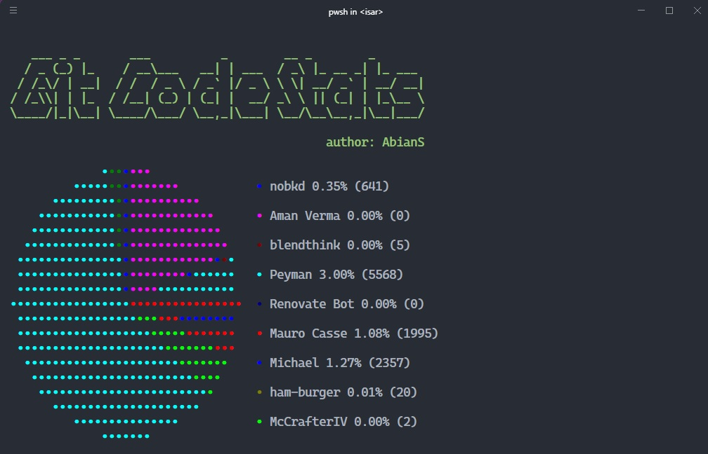

# Git Code Stats

Git Code Stats is a command-line application written in Rust that collects code statistics from Git repositories and creates a pie chart that displays the distribution of lines inserted by author.

## Usage

1. Download the executable from the [releases page](https://github.com/AbianS/git_code_stats/releases/tag/V.1.0.0)
2. Add the executable to your PATH
3. with the terminal, navigate to the folder where the repository is located
4. Run the command `git-stats`

